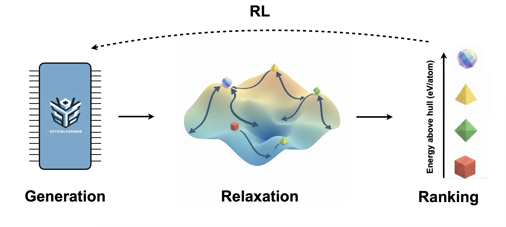

<div align="center">
	
  <h2> Thinking fast and slow for crystal structure prediction</h2> 
</div>

[](https://arxiv.org/abs/2511.XXXXX) 

_CrystalFormer-CSP_ is an autoregressive transformer designed for crystal structure prediction.

<div align="center">
  
  <h3> Generating Cs<sub>2</sub>ZnFe(CN)<sub>6</sub> Crystal (<a href=https://next-gen.materialsproject.org/materials/mp-570545>mp-570545</a>) </h3>
</div>

## Contents

- [Contents](#contents)
- [Model Card](#model-card)
- [Status](#status)
- [Get Started](#get-started)
- [Installation](#installation)
  - [CPU installation](#cpu-installation)
  - [CUDA (GPU) installation](#cuda-gpu-installation)
  - [install required packages](#install-required-packages)
  - [command line tools](#command-line-tools)
- [Available Weights](#available-weights)
- [Crystal Structure Preduction](#crystal-structure-prediction)
- [Advanced Usage](#advanced-usage)
  - [Reinforcement Fine-tuning](#reinforcement-fine-tuning)
  - [Pretrain](#pretrain)
- [How to cite](#how-to-cite)

## Model card

The model is an autoregressive transformer for the formula conditioned crystal probability distribution `P(C|f) = P(g|f) P (W_1 | ... ) P ( A_1 | ... ) P(X_1| ...) P(W_2|...) ... P(L| ...)`, where

- `f`: chemical formula, e.g. `Cu12Sb4S13`
- `g`: space group number 1-230
- `W`: Wyckoff letter ('a', 'b', ...,'A')
- `A`: atom type ('H', 'He', ..., 'Og') in the chemical formula
- `X`: factional coordinates
- `L`: lattice vector [a, b, c, alpha, beta, gamma]
- `P(W_i| ...)` and `P(A_i| ...)` are categorical distributions.
- `P(X_i| ...)` is the mixture of von Mises distribution.
- `P(L| ...)` is the mixture of Gaussian distribution.

We only consider symmetry inequivalent atoms in the crystal representation. The remaining atoms are restored based on the information of space group and Wyckoff letters. There is a natural alphabetical ordering for the Wyckoff letters, starting with 'a' for a position with the site-symmetry group of maximal order and ending with the highest letter for the general position. The sampling procedure starts from higher symmetry sites (with smaller multiplicities) and then goes on to lower symmetry ones (with larger multiplicities). Only for the cases where the Wyckoff letter can not fully determine the structure, one needs to further consider factional coordinates in the loss or sampling. 

## Status

Major milestones are summarized below.
- v0.1 : Initial release developed from _CrystalFormer_ v0.4.2

## Get Started

**Notebooks**: The quickest way to get started with _CrystalFormer-CSP_ is our notebooks in the Google Colab and Bohrium (Chinese version) platforms:

- ColabCSP [](https://colab.research.google.com/drive/1ojSqMQzdnlWZRPOQP20nTvvIh67HXdwp#scrollTo=lKOZgUczOAxE) [](https://www.bohrium.com/notebooks/65312554759): Running _CrystalFormer-CSP_ Seamlessly on Google Colab

## Installation

Create a new environment and install the required packages, we recommend using python `3.10.*` and conda to create the environment:

```bash
  conda create -n crystalgpt python=3.10
  conda activate crystalgpt
```

Before installing the required packages, you need to install `jax` and `jaxlib` first.

### CPU installation

```bash
pip install -U "jax[cpu]"
```

### CUDA (GPU) installation

If you intend to use CUDA (GPU) to speed up the training, it is important to install the appropriate version of `jax` and `jaxlib`. It is recommended to check the [jax docs](https://github.com/google/jax?tab=readme-ov-file#installation) for the installation guide. The basic installation command is given below:

```bash
pip install --upgrade pip

# NVIDIA CUDA 12 installation
# Note: wheels only available on linux.
pip install -U "jax[cuda12]"
```

### install required packages

```bash
pip install -r requirements.txt
```

### command line tools
To use the command line tools, you need to install the `crystalformer` package. You can use the following command to install the package:

```bash
pip install .
```

## Available Weights

We release the weights of the model trained on the [Alex20s](https://huggingface.co/datasets/zdcao/alex-20s) dataset. More details can be seen in the [model card](./MODEL_CARD.md).

## Crystal Structure Prediction

### sample

```bash
python ./main.py --optimizer none --restore_path RESTORE_PATH --K 40 --num_samples 1000 --formula Cu12Sb4S13 --save_path SAVE_PATH
```

- `optimizer`: the optimizer to use, `none` means no training, only sampling
- `restore_path`: the path to the model weights
- `K`: the top-K number of space groups will be sampled uniformly. 
- `num_samples`: the number of samples to generate
- `formula`: the chemical formula 
- `save_path`: [Optional] the path to save the generated structures, if not provided, the structures will be saved in the `RESTORE_PATH` folder.

Instead of providing `K` for top-K sampling, you may directly provide your favorite space group number
- `spacegroup`: the space group number [1-230]

The sampled structure will be saved in the `SAVE_PATH/output_Cu12Sb4S13.csv` file. To transform the generated structure from `g, W, A, X, L` to the `cif` format, you can use the following command

```bash
python ./scripts/awl2struct.py --output_path SAVE_PATH --formula FORMULA 
```

- `output_path`: the path to read the generated `L, W, A, X` and save the `cif` files
- `formula`: the chemical formula constrained in the structure

This will save the generated structures in the `cif` format to a `output_Cu12Sb4S13_struct.csv` file. 

### Relax generated structures with MLFF:

```bash
python scripts/mlff_relax.py \
    --restore_path SAVE_PATH \
    --filename output_Cu12Sb4S13_struct.csv \
    --model orb-v3-conservative-inf-mpa \
    --model_path path/to/orb-v3.ckpt \
    --relaxation
```
This will produce relaxed structure in `relaxed_structures` with predicted energies.

### Energy Above Hull (Ehull)

Compute Ehull for all relaxed structures:

```bash
python scripts/e_above_hull_alex.py \
    --convex_path convex_hull_pbe.json.bz2 \
    --restore_path SAVE_PATH \
    --filename relaxed_structures.csv
```
### End-to-End Pipeline

Run sampling → CIF conversion → relaxation → Ehull ranking:

```bash
./postprocess.sh \
    -r RESTORE_PATH \
    -k epoch_030000.pkl \
    --relaxation true \ 
    -n 1000 
    -f Cu12Sb4S13 
    -s SAVE_PATH
```

In case you are curious about the parameters, run:
```bash 
./postprocess.sh -h 
``` 


## Advanced usage

### Reinforcement Fine-tuning

> [!IMPORTANT]
> Before running the reinforcement fine-tuning, please make sure you have installed the corresponding machine learning force field model or property prediction model. The `mlff_model` and `mlff_path` arguments in the command line should be set according to the model you are using. Now we only support the[`orb`](https://github.com/orbital-materials/orb-models) for the $E_{hull}$ reward. [`BatchRelaxer`](https://github.com/zdcao121/BatchRelaxer) is also needed for batch structure relaxation during the fine-tuning.


```bash
train_ppo --folder ./data/\
          --restore_path YOUR_PATH\
          --reward ehull\
          --convex_path YOUR_PATH/convex_hull_pbe.json.bz2\
          --mlff_model orb-v3-conservative-inf-mpa\
          --mlff_path YOUR_PATH/orb-v3-conservative-inf-mpa-20250404.ckpt \
          --lr 1e-05 \
          --dropout_rate 0.0 \
          --K 40 \
          --batchsize 500 \
          --formula LiPH2O4 
```

where
- `folder`: the folder to save the model and logs
- `restore_path`: the path to the pre-trained model weights
- `reward`: the reward function to use, `ehull` means the energy above the convex hull
- `convex_path`: the path to the convex hull data, which is used to calculate the $E_{hull}$. Only used when the reward is `ehull`
- `mlff_model`: the machine learning force field model to predict the total energy. We support [`orb`](https://github.com/orbital-materials/orb-models) model for the $E_{hull}$ reward
- `mlff_path`: the path to load the checkpoint of the machine learning force field model

### pretrain

```bash
python ./main.py --folder ./data/ --train_path YOUR_PATH/alex20s/train.csv --valid_path YOUR_PATH/alx20s/val.csv 
```
where 
- `folder`: the folder to save the model and logs
- `train_path`: the path to the training dataset
- `valid_path`: the path to the validation dataset


Test the prediction accuracy of space groups on the test dataset

```bash 

python scripts/predict_g.py --restore_path /home/user_wanglei/private/datafile/crystalgpt/csp/alex20s/csp-99fcd/adam_bs_8000_lr_0.0001_decay_0_clip_1_A_119_W_28_N_21_a_1_w_1_l_1_Nf_5_Kx_16_Kl_4_h0_256_l_16_H_8_k_32_m_256_e_256_drop_0.1_0.1/epoch_046000.pkl --valid_path /opt/data/bcmdata/ZONES/data/PROJECTS/datafile/PRIVATE/zdcao/crystal_gpt/dataset/alex/PBE_20241204/test.lmdb --Nf 5 --Kx 16 --Kl 4 --h0_size 256 --transformer_layers 16 --num_heads 8 --key_size 32 --model_size 256 --embed_size 256 --batchsize 1000s
```


## How to cite

```bibtex
@article{cao2024space,
      title={Space Group Informed Transformer for Crystalline Materials Generation}, 
      author={Zhendong Cao and Xiaoshan Luo and Jian Lv and Lei Wang},
      year={2024},
      eprint={2403.15734},
      archivePrefix={arXiv},
      primaryClass={cond-mat.mtrl-sci}
}
```

```bibtex
@article{cao2025crystalformerrl,
      title={CrystalFormer-RL: Reinforcement Fine-Tuning for Materials Design}, 
      author={Zhendong Cao and Lei Wang},
      year={2025},
      eprint={2504.02367},
      archivePrefix={arXiv},
      primaryClass={cond-mat.mtrl-sci},
      url={https://arxiv.org/abs/2504.02367}, 
}
```

```bibtex
@article{cao2025crystalformercsp,
  title={CrystalFormer-CSP: Thinking Fast and Slow for Crystal Structure Prediction},
  author={Cao, Zhendong and Ou, Shigang and Wang, Lei},
  year={2025},
  archivePrefix={arXiv},
  primaryClass={cond-mat.mtrl-sci},
}
```

**Note**: This project is unrelated to https://github.com/omron-sinicx/crystalformer with the same name.
